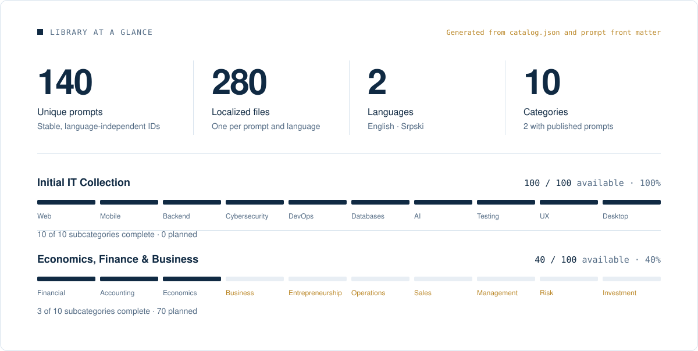

<a id="top"></a>

<div align="center">


<br>
<br>

<!-- UPL:BEGIN hero-badges (generated by `npm run stats`; do not edit by hand) -->
<a href="#collection"></a>
<a href="prompts/en/01-it-programming-technology/README.md"></a>
<a href="README.sr.md"></a>
<a href="LICENSE"></a>
<!-- UPL:END hero-badges -->

<br>

**English** &nbsp;&middot;&nbsp; [Srpski](README.sr.md)

<br>

Deep, reusable AI work specifications for serious analysis, implementation, auditing, research and professional decision-making. Every published prompt is versioned, bilingual and designed to produce structured, reviewable results.

<br>

[Start here](#start-here) &nbsp;&nbsp;/&nbsp;&nbsp;
[Collection](#collection) &nbsp;&nbsp;/&nbsp;&nbsp;
[Categories](#categories) &nbsp;&nbsp;/&nbsp;&nbsp;
[How to use](#how-to-use) &nbsp;&nbsp;/&nbsp;&nbsp;
[Contributing](#contributing) &nbsp;&nbsp;/&nbsp;&nbsp;
[Roadmap](#roadmap) &nbsp;&nbsp;/&nbsp;&nbsp;
[Website](docs/website.md)

</div>

<br>

<a id="start-here"></a>

<h2 align="center">Explore the library</h2>

<table>
<tr>
<td valign="top" width="100%">
<h3>IT, Programming & Technology</h3>
<b>100 / 100 complete</b><br><br>
Production-grade prompts for development, architecture, security, DevOps, data, AI, testing, UX, desktop and systems work.<br><br>
<a href="prompts/en/01-it-programming-technology/README.md"><b>Explore all 100 IT prompts →</b></a>
</td>
<td valign="top" width="100%">
<h3>Economics, Finance & Business</h3>
<b>100 / 100 published</b><br><br>
Deep prompts for finance, accounting, economics, markets, strategy and the business disciplines currently being built.<br><br>
<a href="prompts/en/02-economics-finance-business/README.md"><b>Explore 100 Business prompts →</b></a>
</td>
</tr>
</table>

<table>
<tr>
<td align="center" width="25%"><a href="prompts/en/"><b>English</b></a><br><sub>All EN prompts</sub></td>
<td align="center" width="25%"><a href="prompts/sr/"><b>Srpski</b></a><br><sub>All SR prompts</sub></td>
<td align="center" width="25%"><a href="docs/roadmap.md"><b>Roadmap</b></a><br><sub>Published and planned</sub></td>
<td align="center" width="25%"><a href="CONTRIBUTING.md"><b>Contribute</b></a><br><sub>Write, improve, translate</sub></td>
</tr>
</table>

<a id="about"></a>

<h2 align="center">About</h2>

**Ultimate Prompt Library (UPL)** is a model-agnostic open-source library for serious AI-assisted work. Every prompt is a versioned Markdown artifact with a permanent ID and matching English and Serbian versions.

UPL prompts are intentionally deeper than typical prompt collections. They define scope, evidence standards, failure modes, output structure and validation rules so a capable AI system can do repeatable work instead of returning generic advice.

The **Initial IT Collection** is complete at 100/100. **Economics, Finance & Business** is complete at 100/100. Together with IT, the repository now contains 200 production-grade prompts in English and Serbian. The same architecture is designed to scale across the remaining domains without changing IDs or reorganizing published prompts.

**Featured prompt:** [UPL-IT-001 Forensic Full Repository Audit](prompts/en/01-it-programming-technology/01-web-development/001-forensic-full-repository-audit.md) ([Serbian](prompts/sr/01-it-programiranje-tehnologija/01-web-development/001-forensic-full-repository-audit.md)) is a good first prompt to try and shows the library's core principle: *accuracy over depth over finding count*.

<a id="different"></a>

<h2 align="center">What makes these prompts different</h2>

<p align="center">Each prompt is a long-form working instruction, not a one-line request.<br>Depending on the task, it typically combines the following elements.</p>

<div align="center">

<table>
<tr>
<td valign="top" width="25%">
<b>Focus</b><br><br>
<sub>Clear role<br>Explicit goal<br>Defined scope<br>Explicit non-goals</sub>
</td>
<td valign="top" width="25%">
<b>Evidence</b><br><br>
<sub>Evidence hierarchy<br>Severity ratings<br>Confidence levels<br>False-positive protection</sub>
</td>
<td valign="top" width="25%">
<b>Output</b><br><br>
<sub>Concrete finding format<br>Coverage matrices<br>Output specification<br>Real failure examples</sub>
</td>
<td valign="top" width="25%">
<b>Verification</b><br><br>
<sub>Methodology<br>Checks by area<br>Adversarial second pass<br>Final quality gate</sub>
</td>
</tr>
</table>

<sub>Not every prompt uses every element. A creative writing prompt has no need for P0-P4 severity levels.<br>See the <a href="docs/prompt-format.md">prompt format guide</a>.</sub>

</div>

<a id="collection"></a>

<h2 align="center">Current collection</h2>

<!-- UPL:BEGIN collection-stats (generated by `npm run stats`; do not edit by hand) -->

<!-- UPL:END collection-stats -->

<p align="center"><sub>Only prompts that are actually written are counted. Planned prompts stay in the <a href="docs/roadmap.md">roadmap</a> until they are published.</sub></p>


<!-- UPL:BEGIN subcategory-status (generated by `npm run stats`; do not edit by hand) -->
### IT, Programming & Technology

| # | Subcategory | Available | Status |
|:---:|---|:---:|---|
| 01 | [Web Development](prompts/en/01-it-programming-technology/01-web-development/README.md) | 10 / 10 | Complete |
| 02 | [Mobile Development](prompts/en/01-it-programming-technology/02-mobile-development/README.md) | 10 / 10 | Complete |
| 03 | [Backend & API](prompts/en/01-it-programming-technology/03-backend-api/README.md) | 10 / 10 | Complete |
| 04 | [Cybersecurity](prompts/en/01-it-programming-technology/04-cybersecurity/README.md) | 10 / 10 | Complete |
| 05 | [DevOps, Cloud & Infrastructure](prompts/en/01-it-programming-technology/05-devops-cloud-infrastructure/README.md) | 10 / 10 | Complete |
| 06 | [Databases & Data Engineering](prompts/en/01-it-programming-technology/06-databases-data-engineering/README.md) | 10 / 10 | Complete |
| 07 | [AI, LLM & Automation](prompts/en/01-it-programming-technology/07-ai-llm-automation/README.md) | 10 / 10 | Complete |
| 08 | [Testing, QA & Reliability](prompts/en/01-it-programming-technology/08-testing-qa-reliability/README.md) | 10 / 10 | Complete |
| 09 | [UX, UI & Product Development](prompts/en/01-it-programming-technology/09-ux-ui-product-development/README.md) | 10 / 10 | Complete |
| 10 | [Desktop, Game, Systems & Embedded](prompts/en/01-it-programming-technology/10-desktop-game-systems-embedded/README.md) | 10 / 10 | Complete |

### Economics, Finance & Business

| # | Subcategory | Available | Status |
|:---:|---|:---:|---|
| 01 | [Financial Analysis & Corporate Finance](prompts/en/02-economics-finance-business/01-financial-analysis-corporate-finance/README.md) | 10 / 10 | Complete |
| 02 | [Accounting, Reporting & Financial Control](prompts/en/02-economics-finance-business/02-accounting-reporting-financial-control/README.md) | 10 / 10 | Complete |
| 03 | [Economics & Market Analysis](prompts/en/02-economics-finance-business/03-economics-market-analysis/README.md) | 10 / 10 | Complete |
| 04 | [Business Strategy & Competitive Analysis](prompts/en/02-economics-finance-business/04-business-strategy-competitive-analysis/README.md) | 10 / 10 | Complete |
| 05 | [Entrepreneurship & Business Models](prompts/en/02-economics-finance-business/05-entrepreneurship-business-models/README.md) | 10 / 10 | Complete |
| 06 | [Operations, Supply Chain & Procurement](prompts/en/02-economics-finance-business/06-operations-supply-chain-procurement/README.md) | 10 / 10 | Complete |
| 07 | [Sales, Revenue & Pricing](prompts/en/02-economics-finance-business/07-sales-revenue-pricing/README.md) | 10 / 10 | Complete |
| 08 | [Management, Leadership & Organization](prompts/en/02-economics-finance-business/08-management-leadership-organization/README.md) | 10 / 10 | Complete |
| 09 | [Risk, Compliance & Business Resilience](prompts/en/02-economics-finance-business/09-risk-compliance-business-resilience/README.md) | 10 / 10 | Complete |
| 10 | [Investment, Valuation & Due Diligence](prompts/en/02-economics-finance-business/10-investment-valuation-due-diligence/README.md) | 10 / 10 | Complete |
<!-- UPL:END subcategory-status -->

<br>

**[Browse all 100 IT prompts &rarr;](prompts/en/01-it-programming-technology/README.md)**  
**[Browse all 100 Business prompts &rarr;](prompts/en/02-economics-finance-business/README.md)**

<a id="categories"></a>

<h2 align="center">Categories</h2>

<p align="center">Ten main categories, each with its own permanent ID namespace, for example <code>UPL-IT-001</code> or <code>UPL-BIZ-001</code>.</p>

<div align="center">

<!-- UPL:BEGIN category-status (generated by `npm run stats`; do not edit by hand) -->
<table>
<tr>
<td align="center" valign="top" width="20%">
<sub>01</sub><br>
<a href="prompts/en/01-it-programming-technology/README.md"><b>IT, Programming &amp; Technology</b></a><br>
<sub><code>UPL-IT</code></sub><br>
<sub>Complete · 100 / 100</sub>
</td>
<td align="center" valign="top" width="20%">
<sub>02</sub><br>
<a href="prompts/en/02-economics-finance-business/README.md"><b>Economics, Finance &amp; Business</b></a><br>
<sub><code>UPL-BIZ</code></sub><br>
<sub>Complete · 100 / 100</sub>
</td>
<td align="center" valign="top" width="20%">
<sub>03</sub><br>
<a href="prompts/en/03-law-administration/README.md"><b>Law &amp; Administration</b></a><br>
<sub><code>UPL-LAW</code></sub><br>
<sub>Planned</sub>
</td>
<td align="center" valign="top" width="20%">
<sub>04</sub><br>
<a href="prompts/en/04-health-medicine-wellness/README.md"><b>Health, Medicine &amp; Wellness</b></a><br>
<sub><code>UPL-HEALTH</code></sub><br>
<sub>Planned</sub>
</td>
<td align="center" valign="top" width="20%">
<sub>05</sub><br>
<a href="prompts/en/05-education-learning/README.md"><b>Education &amp; Learning</b></a><br>
<sub><code>UPL-EDU</code></sub><br>
<sub>Planned</sub>
</td>
</tr>
<tr>
<td align="center" valign="top" width="20%">
<sub>06</sub><br>
<a href="prompts/en/06-science-research-analysis/README.md"><b>Science, Research &amp; Analysis</b></a><br>
<sub><code>UPL-SCI</code></sub><br>
<sub>Planned</sub>
</td>
<td align="center" valign="top" width="20%">
<sub>07</sub><br>
<a href="prompts/en/07-career-professional-development/README.md"><b>Career &amp; Professional Development</b></a><br>
<sub><code>UPL-CAREER</code></sub><br>
<sub>Planned</sub>
</td>
<td align="center" valign="top" width="20%">
<sub>08</sub><br>
<a href="prompts/en/08-marketing-sales-communication/README.md"><b>Marketing, Sales &amp; Communication</b></a><br>
<sub><code>UPL-MKT</code></sub><br>
<sub>Planned</sub>
</td>
<td align="center" valign="top" width="20%">
<sub>09</sub><br>
<a href="prompts/en/09-productivity-organization-management/README.md"><b>Productivity, Organization &amp; Management</b></a><br>
<sub><code>UPL-PROD</code></sub><br>
<sub>Planned</sub>
</td>
<td align="center" valign="top" width="20%">
<sub>10</sub><br>
<a href="prompts/en/10-creativity-design-media/README.md"><b>Creativity, Design &amp; Media</b></a><br>
<sub><code>UPL-CREATIVE</code></sub><br>
<sub>Planned</sub>
</td>
</tr>
</table>
<!-- UPL:END category-status -->

<sub>Descriptions of every category are in <a href="docs/categories.md">docs/categories.md</a>.</sub>

</div>

<a id="how-to-use"></a>

<h2 align="center">How to use</h2>

<div align="center">

<table>
<tr>
<td valign="top" width="20%">
<sub>01</sub><br>
<b>Pick</b><br>
<sub>Open the prompt that matches your task, in your language.</sub>
</td>
<td valign="top" width="20%">
<sub>02</sub><br>
<b>Copy</b><br>
<sub>Copy the whole file. The front matter is metadata and can be left out.</sub>
</td>
<td valign="top" width="20%">
<sub>03</sub><br>
<b>Paste</b><br>
<sub>Give it to a chat assistant, a coding agent or a local model.</sub>
</td>
<td valign="top" width="20%">
<sub>04</sub><br>
<b>Add context</b><br>
<sub>Attach the repository, files, documents or data to analyze.</sub>
</td>
<td valign="top" width="20%">
<sub>05</sub><br>
<b>Adjust scope</b><br>
<sub>Narrow it to one service or module when you need less.</sub>
</td>
</tr>
</table>

</div>

<p align="center"><b>Model-agnostic.</b> The prompts work with ChatGPT, Claude, Gemini, local LLMs, coding agents and any other capable AI system.<br><sub>Results depend on the model, the context you provide and the tools it can use. Always review the output.<br>For machine use, <a href="indexes/prompts.json"><code>indexes/prompts.json</code></a> lists every available prompt with its ID, titles, status, version and paths.</sub></p>

> **Security.** The cybersecurity prompts are meant for defensive review, authorized testing, secure development and threat modeling. **Use security prompts only on systems you own or are explicitly authorized to test.** See [SECURITY.md](SECURITY.md).

<a id="structure"></a>

<h2 align="center">Repository structure</h2>

```text
ultimate-prompt-library/
├── prompts/
│   ├── en/                                    English prompts
│   │   ├── 01-it-programming-technology/
│   │   │   ├── README.md                      full IT index (available + planned)
│   │   │   ├── 01-web-development/
│   │   │   │   ├── README.md
│   │   │   │   └── 001-forensic-full-repository-audit.md
│   │   │   └── ...
│   │   └── 02-economics-finance-business/ ... 10-creativity-design-media/
│   └── sr/                                    Serbian prompts (same subfolders and filenames)
├── catalog.json                               categories, subcategories, planned prompt IDs
├── indexes/                                   generated JSON indexes and statistics
├── assets/                                    generated README artwork and embedded fonts
├── docs/                                      format, IDs, translation, architecture, roadmap
├── scripts/                                   validation, indexes and website generation
├── site-src/                                  website CSS and client interactions
├── vercel.json                                static website deployment config
└── .github/                                   issue/PR templates and the validation workflow
```

<p align="center">Every prompt lives at <code>prompts/&lt;language&gt;/&lt;category&gt;/&lt;subcategory&gt;/NNN-slug.md</code>.<br>English and Serbian share the same subcategory folder and filename, so switching language only changes the language folder.<br><sub><a href="docs/architecture.md">Architecture</a> &nbsp;/&nbsp; <a href="docs/ids.md">ID rules</a></sub></p>

<a id="languages"></a>

<h2 align="center">Languages</h2>

<div align="center">

| Language | Folder | Coverage |
|---|---|---|
| **English** (primary) | [`prompts/en/`](prompts/en/) | Every available prompt |
| **Serbian**, Latin script | [`prompts/sr/`](prompts/sr/) | Every available prompt |

<sub>A prompt becomes <code>stable</code> only when every supported language is present. Both versions share the same ID, number, slug and version.<br>Technical terminology intentionally stays in English where that is natural. See the <a href="docs/translation-guide.md">translation guide</a>.</sub>

</div>

<a id="format"></a>

<h2 align="center">Prompt format</h2>

<p align="center">Every prompt starts with YAML front matter. The <code>id</code> is permanent and shared by all languages.</p>

```yaml
---
id: UPL-IT-035
number: 35
slug: secrets-and-credential-exposure-audit
title: Secrets & Credential Exposure Audit
category: IT, Programming & Technology
category_id: UPL-IT
subcategory: Cybersecurity
subcategory_id: cybersecurity
language: en
version: 1.0.0
status: stable          # draft | review | stable | deprecated
---
```

<div align="center">

| Label | Meaning |
|---|---|
| **Available** | Published with status `stable`: structurally complete and ready for general use, in every language |
| **In review** / **Draft** | Published, but content, translation or factual review is still in progress |
| **Deprecated** | Kept for history or compatibility; no longer the recommended version |
| **Planned** | ID, title and filename are reserved; the prompt is not written yet and is never counted |

<sub>Available is not "expert-certified": a stable prompt is not independently audited or guaranteed, and results still depend on the model, your context and review.<br>Field rules, versioning (PATCH, MINOR, MAJOR) and the recommended body structure are in <a href="docs/prompt-format.md">docs/prompt-format.md</a>.</sub>

</div>

<a id="contributing"></a>

<h2 align="center">Contributing</h2>

<div align="center">

<table>
<tr>
<td valign="top" width="33%">
<b>Write a planned prompt</b><br>
<sub>Planned prompts already have an ID. Reference it in your issue or pull request and never assign a new one.</sub>
</td>
<td valign="top" width="33%">
<b>Propose a new prompt</b><br>
<sub>Open a prompt suggestion issue first. IDs are assigned through <code>catalog.json</code> once the proposal is accepted.</sub>
</td>
<td valign="top" width="33%">
<b>Improve or translate</b><br>
<sub>Keep the ID and filename, update both languages and bump the version.</sub>
</td>
</tr>
</table>

</div>

<p align="center">The repository includes validation tooling that runs locally. Run it before every pull request:</p>

```bash
npm ci               # install the single tooling dependency
npm run generate     # rebuild indexes, README tables and artwork after a change
npm run validate     # prompts, translations, links and generated files (0 errors required)
```

<p align="center"><a href="CONTRIBUTING.md">Contributing guide</a> &nbsp;/&nbsp; <a href="CODE_OF_CONDUCT.md">Code of Conduct</a> &nbsp;/&nbsp; <a href="SECURITY.md">Security policy</a></p>

<a id="quality"></a>

<h2 align="center">Quality standard</h2>

<div align="center">

<table>
<tr>
<td valign="top" width="33%"><b>Deep over generic</b><br><sub>Cover a problem thoroughly, not with surface-level tips.</sub></td>
<td valign="top" width="33%"><b>Evidence over assumptions</b><br><sub>Findings are backed by what is actually in the material.</sub></td>
<td valign="top" width="33%"><b>Concrete over vague</b><br><sub>Precise checks, formats and examples.</sub></td>
</tr>
<tr>
<td valign="top"><b>Production-oriented</b><br><sub>Real-world failures, not textbook theory.</sub></td>
<td valign="top"><b>False-positive aware</b><br><sub>Guards against confident but wrong conclusions.</sub></td>
<td valign="top"><b>Model-agnostic</b><br><sub>Usable with any capable AI system.</sub></td>
</tr>
<tr>
<td valign="top"><b>Reusable</b><br><sub>Every prompt is a self-contained artifact.</sub></td>
<td valign="top"><b>Bilingual</b><br><sub>English and Serbian are kept in step.</sub></td>
<td valign="top"><b>Open-source</b><br><sub>Free to use, study, adapt and improve.</sub></td>
</tr>
</table>

<sub>The local validation tooling verifies structure only: front matter, IDs, filenames, language pairs and their structural parity, generated files and internal links.<br>Prompt quality is the job of review.</sub>

</div>

<a id="roadmap"></a>

<h2 align="center">Roadmap</h2>

<div align="center">

| Stage | Scope | Status |
|:---:|---|---|
| Phase 1 | **Initial IT Collection**: 100 IT, Programming & Technology prompts | Complete |
| Phase 2 | **Initial Business Collection**: 100 Economics, Finance & Business prompts | In progress |
| Next | The eight remaining categories, designed one category at a time | Planned |
| Later | Website with search, filters, language switch and permalinks, built on the generated indexes | Idea |

<br>

**[Full roadmap &rarr;](docs/roadmap.md)**

</div>

<a id="license"></a>

<h2 align="center">License</h2>

<p align="center">Released under the <a href="LICENSE">MIT License</a>. Changes are recorded in the <a href="CHANGELOG.md">changelog</a>.<br><sub>Artwork fonts: Inter and JetBrains Mono, SIL Open Font License 1.1 (<a href="assets/fonts/">assets/fonts</a>).</sub></p>

<br>

<div align="center">

<sub>Community-driven &nbsp;/&nbsp; Model-agnostic &nbsp;/&nbsp; Built for serious work</sub>

<br>

[Back to top &uarr;](#top)

</div>
