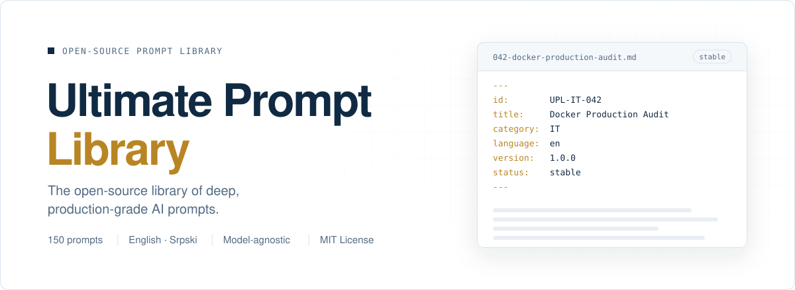

<a id="top"></a>

<p align="center">
  <picture>
    <source media="(prefers-color-scheme: dark)" srcset="assets/banner.en.dark.svg">
    
  </picture>
</p>

<div align="center">

<!-- UPL:BEGIN hero-badges (generated by `npm run stats`; do not edit by hand) -->
<a href="#collection"></a>
<a href="prompts/en/01-it-programming-technology/README.md"></a>
<a href="prompts/en/02-economics-finance-business/README.md"></a>
<a href="README.sr.md"></a>
<a href="LICENSE"></a>
<!-- UPL:END hero-badges -->

**English** &nbsp; · &nbsp; [Srpski](README.sr.md)

Deep, reusable AI work specifications for serious analysis, engineering, research and business decisions. Each prompt is versioned, bilingual and built to produce structured results you can review.

[**Open the library**](https://ultimate-prompt-library.vercel.app) &nbsp; · &nbsp; [Browse prompts](#start-here) &nbsp; · &nbsp; [Contribute](#contributing)

</div>

<a id="start-here"></a>

## Explore the collections

### 01 · IT, Programming & Technology

**100 prompts · Complete**<br>
Development, architecture, security, DevOps, data, AI, testing and product work.

[Explore the IT collection →](prompts/en/01-it-programming-technology/README.md)

### 02 · Economics, Finance & Business

**100 prompts · Complete**<br>
Finance, accounting, markets, strategy, operations, management and risk.

[Explore the Business collection →](prompts/en/02-economics-finance-business/README.md)

<a id="collection"></a>

## The library at a glance

<!-- UPL:BEGIN collection-stats (generated by `npm run stats`; do not edit by hand) -->
<table width="100%">
<tr>
<td valign="top" width="50%"><h2>200</h2><strong>Unique prompts</strong><br><sub>Permanent IDs make every prompt easy to reference</sub></td>
<td valign="top" width="50%"><h2>400</h2><strong>Localized files</strong><br><sub>Matched English and Serbian files for every prompt</sub></td>
</tr>
<tr>
<td valign="top" width="50%"><h2>2</h2><strong>Languages</strong><br><sub>English and Serbian, connected by shared IDs</sub></td>
<td valign="top" width="50%"><h2>2 / 10</h2><strong>Active categories</strong><br><sub>Published collections in a ten-category library</sub></td>
</tr>
</table>
<!-- UPL:END collection-stats -->

<a id="categories"></a>

## Ten permanent categories

Category IDs remain stable as the library grows. Published collections link directly to their prompt indexes; upcoming areas are clearly marked.

<!-- UPL:BEGIN category-status (generated by `npm run stats`; do not edit by hand) -->
<table width="100%">
<tr>
<td valign="top" width="50%">
<sub>01 · <code>UPL-IT</code></sub><br>
<a href="prompts/en/01-it-programming-technology/README.md"><strong>IT, Programming &amp; Technology</strong></a><br>
<sub>Complete · 100 / 100</sub>
</td>
<td valign="top" width="50%">
<sub>02 · <code>UPL-BIZ</code></sub><br>
<a href="prompts/en/02-economics-finance-business/README.md"><strong>Economics, Finance &amp; Business</strong></a><br>
<sub>Complete · 100 / 100</sub>
</td>
</tr>
<tr>
<td valign="top" width="50%">
<sub>03 · <code>UPL-LAW</code></sub><br>
<a href="prompts/en/03-law-administration/README.md"><strong>Law &amp; Administration</strong></a><br>
<sub>Planned</sub>
</td>
<td valign="top" width="50%">
<sub>04 · <code>UPL-HEALTH</code></sub><br>
<a href="prompts/en/04-health-medicine-wellness/README.md"><strong>Health, Medicine &amp; Wellness</strong></a><br>
<sub>Planned</sub>
</td>
</tr>
<tr>
<td valign="top" width="50%">
<sub>05 · <code>UPL-EDU</code></sub><br>
<a href="prompts/en/05-education-learning/README.md"><strong>Education &amp; Learning</strong></a><br>
<sub>Planned</sub>
</td>
<td valign="top" width="50%">
<sub>06 · <code>UPL-SCI</code></sub><br>
<a href="prompts/en/06-science-research-analysis/README.md"><strong>Science, Research &amp; Analysis</strong></a><br>
<sub>Planned</sub>
</td>
</tr>
<tr>
<td valign="top" width="50%">
<sub>07 · <code>UPL-CAREER</code></sub><br>
<a href="prompts/en/07-career-professional-development/README.md"><strong>Career &amp; Professional Development</strong></a><br>
<sub>Planned</sub>
</td>
<td valign="top" width="50%">
<sub>08 · <code>UPL-MKT</code></sub><br>
<a href="prompts/en/08-marketing-sales-communication/README.md"><strong>Marketing, Sales &amp; Communication</strong></a><br>
<sub>Planned</sub>
</td>
</tr>
<tr>
<td valign="top" width="50%">
<sub>09 · <code>UPL-PROD</code></sub><br>
<a href="prompts/en/09-productivity-organization-management/README.md"><strong>Productivity, Organization &amp; Management</strong></a><br>
<sub>Planned</sub>
</td>
<td valign="top" width="50%">
<sub>10 · <code>UPL-CREATIVE</code></sub><br>
<a href="prompts/en/10-creativity-design-media/README.md"><strong>Creativity, Design &amp; Media</strong></a><br>
<sub>Planned</sub>
</td>
</tr>
</table>
<!-- UPL:END category-status -->

### Published subcategories

<!-- UPL:BEGIN subcategory-status (generated by `npm run stats`; do not edit by hand) -->
<details>
<summary><strong>IT, Programming &amp; Technology</strong> · 10 / 10 subcategories complete</summary>

| # | Subcategory |
|:---:|---|
| 01 | [Web Development](prompts/en/01-it-programming-technology/01-web-development/README.md) · 10 / 10 · Complete |
| 02 | [Mobile Development](prompts/en/01-it-programming-technology/02-mobile-development/README.md) · 10 / 10 · Complete |
| 03 | [Backend & API](prompts/en/01-it-programming-technology/03-backend-api/README.md) · 10 / 10 · Complete |
| 04 | [Cybersecurity](prompts/en/01-it-programming-technology/04-cybersecurity/README.md) · 10 / 10 · Complete |
| 05 | [DevOps, Cloud & Infrastructure](prompts/en/01-it-programming-technology/05-devops-cloud-infrastructure/README.md) · 10 / 10 · Complete |
| 06 | [Databases & Data Engineering](prompts/en/01-it-programming-technology/06-databases-data-engineering/README.md) · 10 / 10 · Complete |
| 07 | [AI, LLM & Automation](prompts/en/01-it-programming-technology/07-ai-llm-automation/README.md) · 10 / 10 · Complete |
| 08 | [Testing, QA & Reliability](prompts/en/01-it-programming-technology/08-testing-qa-reliability/README.md) · 10 / 10 · Complete |
| 09 | [UX, UI & Product Development](prompts/en/01-it-programming-technology/09-ux-ui-product-development/README.md) · 10 / 10 · Complete |
| 10 | [Desktop, Game, Systems & Embedded](prompts/en/01-it-programming-technology/10-desktop-game-systems-embedded/README.md) · 10 / 10 · Complete |

</details>

<details>
<summary><strong>Economics, Finance &amp; Business</strong> · 10 / 10 subcategories complete</summary>

| # | Subcategory |
|:---:|---|
| 01 | [Financial Analysis & Corporate Finance](prompts/en/02-economics-finance-business/01-financial-analysis-corporate-finance/README.md) · 10 / 10 · Complete |
| 02 | [Accounting, Reporting & Financial Control](prompts/en/02-economics-finance-business/02-accounting-reporting-financial-control/README.md) · 10 / 10 · Complete |
| 03 | [Economics & Market Analysis](prompts/en/02-economics-finance-business/03-economics-market-analysis/README.md) · 10 / 10 · Complete |
| 04 | [Business Strategy & Competitive Analysis](prompts/en/02-economics-finance-business/04-business-strategy-competitive-analysis/README.md) · 10 / 10 · Complete |
| 05 | [Entrepreneurship & Business Models](prompts/en/02-economics-finance-business/05-entrepreneurship-business-models/README.md) · 10 / 10 · Complete |
| 06 | [Operations, Supply Chain & Procurement](prompts/en/02-economics-finance-business/06-operations-supply-chain-procurement/README.md) · 10 / 10 · Complete |
| 07 | [Sales, Revenue & Pricing](prompts/en/02-economics-finance-business/07-sales-revenue-pricing/README.md) · 10 / 10 · Complete |
| 08 | [Management, Leadership & Organization](prompts/en/02-economics-finance-business/08-management-leadership-organization/README.md) · 10 / 10 · Complete |
| 09 | [Risk, Compliance & Business Resilience](prompts/en/02-economics-finance-business/09-risk-compliance-business-resilience/README.md) · 10 / 10 · Complete |
| 10 | [Investment, Valuation & Due Diligence](prompts/en/02-economics-finance-business/10-investment-valuation-due-diligence/README.md) · 10 / 10 · Complete |

</details>
<!-- UPL:END subcategory-status -->

<a id="about"></a>

## Built for work that needs more than a quick answer

Ultimate Prompt Library (UPL) is a model-agnostic, open-source collection of detailed instructions for AI-assisted work. Prompts define scope, evidence standards, failure modes, expected outputs and verification steps, helping capable models produce work that is structured and reviewable.

**A good first read:** [UPL-IT-001 · Forensic Full Repository Audit](prompts/en/01-it-programming-technology/01-web-development/001-forensic-full-repository-audit.md) · [Srpski](prompts/sr/01-it-programiranje-tehnologija/01-web-development/001-forensic-full-repository-audit.md)

<a id="different"></a>

### A consistent standard for every prompt

- **Focused:** a defined role, goal, scope and set of non-goals.
- **Evidence-led:** clear source priorities, confidence and false-positive safeguards.
- **Useful output:** concrete formats, examples and coverage expectations.
- **Verifiable:** practical checks and a final quality gate where the task needs them.

See the [prompt format guide](docs/prompt-format.md) for the full specification.

<a id="how-to-use"></a>

## Put a prompt to work

1. Open a prompt in [English](prompts/en/) or [Serbian](prompts/sr/).
2. Copy the prompt body into ChatGPT, Claude, Gemini, a coding agent or another capable model. Front matter at the top is metadata and can be omitted.
3. Attach the files, repository or other context the task needs.
4. Narrow the scope when you want the work focused on a specific module or question.
5. Review the result. Quality depends on the model, context and available tools.

The machine-readable [`prompts.json`](indexes/prompts.json) index lists prompt IDs, titles, statuses, versions and paths.

<a id="structure"></a>

## A simple, stable structure

```text
prompts/       English and Serbian prompt files, grouped by category
catalog.json   Category definitions, permanent IDs and planned entries
indexes/       Generated JSON indexes and collection statistics
docs/          Prompt format, architecture, translation and roadmap
scripts/       Generation and validation tools
site-src/      Source for the searchable library website
```

<a id="languages"></a>

## English and Serbian, kept in sync

Every published prompt has the same permanent ID, number, slug and version in both languages. A prompt is marked stable when all supported language versions are present. Technical terms stay in English where that reads most naturally.

<a id="format"></a>

## Prompt files are versioned documents

Each Markdown file begins with YAML metadata. The permanent ID connects language versions and stays unchanged when the wording evolves. See the [format guide](docs/prompt-format.md) and [ID rules](docs/ids.md).

<a id="contributing"></a>

## Help the library grow

Improve an existing prompt, translate it, or propose an idea through the [contribution guide](CONTRIBUTING.md). Planned prompts already have reserved IDs, so check [`catalog.json`](catalog.json) before proposing additions.

```bash
npm ci
npm run generate
npm run validate
```

<a id="quality"></a>

Validation checks prompt structure, IDs, language pairs, internal links and generated files. It does not certify the quality of an AI response. Review outputs before relying on them.

> **Security:** Use cybersecurity prompts only for defensive review, secure development or testing systems you own or are explicitly authorized to assess. Read the [security policy](SECURITY.md).

<a id="roadmap"></a>

## What comes next

The IT and Business collections are complete. The remaining eight categories are planned and will be developed one at a time. The [public website](https://ultimate-prompt-library.vercel.app) is live with search, filters, language switching and permanent prompt links.

Follow the [full roadmap](docs/roadmap.md) for collection plans and project direction.

<a id="license"></a>

## Open source and support

Released under the [MIT License](LICENSE). Read the [Code of Conduct](CODE_OF_CONDUCT.md), [security policy](SECURITY.md) and [changelog](CHANGELOG.md).

If this library is useful to you, support its development on [Ko-fi](https://ko-fi.com/o0o0o0o) or [PayPal](https://www.paypal.com/paypalme/o0o0o0o0o0o0o).

<p align="center"><sub>Community-built · Model-agnostic · Made for serious work</sub><br><a href="#top">Back to top ↑</a></p>
