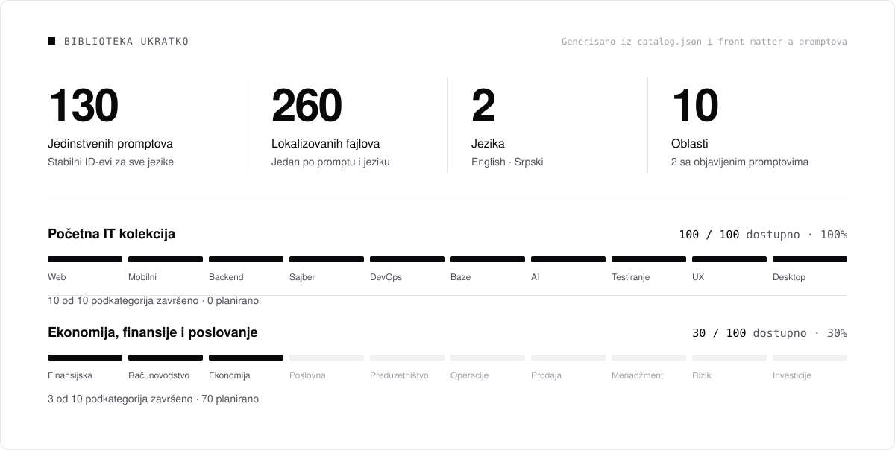

<a id="top"></a>

<div align="center">

<picture>
  <source media="(prefers-color-scheme: dark)" srcset="assets/banner.sr.dark.svg">
  
</picture>

<br>
<br>

<!-- UPL:BEGIN hero-badges (generated by `npm run stats`; do not edit by hand) -->
<a href="#kolekcija"></a>
<a href="prompts/sr/01-it-programiranje-tehnologija/README.md"></a>
<a href="README.md"></a>
<a href="LICENSE"></a>
<!-- UPL:END hero-badges -->

<br>

[English](README.md) &nbsp;&middot;&nbsp; **Srpski**

<br>

Sveobuhvatna kolekcija pažljivo strukturiranih promptova namenjenih ozbiljnoj analizi, implementaciji, auditu, istraživanju i profesionalnom radu u oblastima tehnologije, poslovanja, prava, zdravlja, obrazovanja, nauke, razvoja karijere, marketinga, produktivnosti, kreativnosti i drugim.

<br>

[Počni ovde](#pocni-ovde) &nbsp;&nbsp;/&nbsp;&nbsp;
[Kolekcija](#kolekcija) &nbsp;&nbsp;/&nbsp;&nbsp;
[Oblasti](#oblasti) &nbsp;&nbsp;/&nbsp;&nbsp;
[Kako se koristi](#kako-se-koristi) &nbsp;&nbsp;/&nbsp;&nbsp;
[Doprinos](#doprinos) &nbsp;&nbsp;/&nbsp;&nbsp;
[Roadmap](#roadmap)

</div>

<br>

<a id="pocni-ovde"></a>

<h2 align="center">Počni ovde</h2>

<div align="center">

<table>
<tr>
<td align="center" valign="top" width="20%">
<sub>01</sub><br>
<a href="prompts/sr/01-it-programiranje-tehnologija/README.md"><b>IT kolekcija</b></a><br>
<sub>Svih 100 IT promptova sa statusom i linkovima</sub>
</td>
<td align="center" valign="top" width="20%">
<sub>02</sub><br>
<a href="prompts/sr/"><b>Promptovi na srpskom</b></a><br>
<sub>Kompletan folder <code>prompts/sr</code></sub>
</td>
<td align="center" valign="top" width="20%">
<sub>03</sub><br>
<a href="prompts/en/"><b>Promptovi na engleskom</b></a><br>
<sub>Kompletan folder <code>prompts/en</code></sub>
</td>
<td align="center" valign="top" width="20%">
<sub>04</sub><br>
<a href="docs/roadmap.sr.md"><b>Roadmap</b></a><br>
<sub>Šta je planirano i šta sledi</sub>
</td>
<td align="center" valign="top" width="20%">
<sub>05</sub><br>
<a href="CONTRIBUTING.sr.md"><b>Doprinos</b></a><br>
<sub>Napiši, poboljšaj ili prevedi prompt</sub>
</td>
</tr>
</table>

</div>

<a id="o-projektu"></a>

<h2 align="center">O projektu</h2>

**Ultimate Prompt Library (UPL)** je open-source biblioteka promptova za ozbiljan rad koja stalno raste, koju razvija zajednica i koja ne zavisi od konkretnog AI modela. Svaki prompt je običan Markdown fajl sa trajnim ID-em, objavljen na engleskom i srpskom jeziku (latinica).

Većina kolekcija promptova sastoji se od kratkih rečenica koje daju generičke rezultate. Audit produkcionog koda, pregled bezbednosne granice ili analiza poslovne odluke zahtevaju prompt koji sposobnom AI sistemu kaže šta da ispita, kako da vrednuje dokaze, kako da izbegne lažno pozitivne nalaze i kako izgleda koristan rezultat. UPL okuplja takve promptove na jednom mestu, verzioniše ih, održava na dva jezika i organizuje ih tako da biblioteka može da poraste sa nekoliko desetina na hiljade promptova bez reorganizacije.

Prva kolekcija, **početna IT kolekcija**, sadrži 100 promptova za softversko inženjerstvo koji se objavljuju postepeno.

Mnogi UPL promptovi su bliži višekratnim specifikacijama za audit ili rad nego klasičnim promptovima od jedne rečenice. Zato neki od njih imaju desetine ili čak stotine numerisanih sekcija, dok su drugi kratke, fokusirane liste provera.

**Izdvojeni prompt:** [UPL-IT-001 Forensic Full Repository Audit](prompts/sr/01-it-programiranje-tehnologija/01-web-development/001-forensic-full-repository-audit.md) ([engleski](prompts/en/01-it-programming-technology/01-web-development/001-forensic-full-repository-audit.md)) je dobar prvi prompt za isprobavanje i pokazuje osnovni princip biblioteke: *tačnost ispred dubine, a dubina ispred broja nalaza*.

<a id="razlike"></a>

<h2 align="center">Po čemu se ovi promptovi razlikuju</h2>

<p align="center">Svaki prompt je detaljno radno uputstvo, a ne zahtev od jedne rečenice.<br>U zavisnosti od zadatka, obično kombinuje sledeće elemente.</p>

<div align="center">

<table>
<tr>
<td valign="top" width="25%">
<b>Fokus</b><br><br>
<sub>Jasna uloga<br>Eksplicitan cilj<br>Definisan obim<br>Eksplicitni ne-ciljevi</sub>
</td>
<td valign="top" width="25%">
<b>Dokazi</b><br><br>
<sub>Hijerarhija dokaza<br>Ocene ozbiljnosti<br>Nivoi pouzdanosti<br>Zaštita od lažno pozitivnih</sub>
</td>
<td valign="top" width="25%">
<b>Izlaz</b><br><br>
<sub>Konkretan format nalaza<br>Matrice pokrivenosti<br>Specifikacija izlaza<br>Primeri stvarnih grešaka</sub>
</td>
<td valign="top" width="25%">
<b>Provera</b><br><br>
<sub>Metodologija<br>Provere po oblastima<br>Adversarijalni drugi prolaz<br>Završna provera kvaliteta</sub>
</td>
</tr>
</table>

<sub>Ne koristi svaki prompt svaki element. Promptu za kreativno pisanje nisu potrebni nivoi ozbiljnosti P0-P4.<br>Pogledaj <a href="docs/prompt-format.sr.md">vodič za format promptova</a>.</sub>

</div>

<a id="kolekcija"></a>

<h2 align="center">Trenutna kolekcija</h2>

<!-- UPL:BEGIN collection-stats (generated by `npm run stats`; do not edit by hand) -->
<picture>
  <source media="(prefers-color-scheme: dark)" srcset="assets/stats.sr.dark.svg">
  
</picture>
<!-- UPL:END collection-stats -->

<div align="center">

<sub>Broje se samo promptovi koji su zaista napisani. Planirani promptovi su navedeni u <a href="docs/roadmap.sr.md">roadmap-u</a> i nikada se ne računaju kao dostupni.</sub>

<br>

<!-- UPL:BEGIN subcategory-status (generated by `npm run stats`; do not edit by hand) -->
| # | Podkategorija | Dostupno | Status |
|:---:|---|:---:|---|
| 01 | [Web razvoj](prompts/sr/01-it-programiranje-tehnologija/01-web-development/README.md) | 10 / 10 | Završeno |
| 02 | [Mobilni razvoj](prompts/sr/01-it-programiranje-tehnologija/02-mobile-development/README.md) | 10 / 10 | Završeno |
| 03 | [Backend i API](prompts/sr/01-it-programiranje-tehnologija/03-backend-api/README.md) | 10 / 10 | Završeno |
| 04 | [Sajber bezbednost](prompts/sr/01-it-programiranje-tehnologija/04-cybersecurity/README.md) | 10 / 10 | Završeno |
| 05 | [DevOps, cloud i infrastruktura](prompts/sr/01-it-programiranje-tehnologija/05-devops-cloud-infrastructure/README.md) | 10 / 10 | Završeno |
| 06 | [Baze podataka i data engineering](prompts/sr/01-it-programiranje-tehnologija/06-databases-data-engineering/README.md) | 10 / 10 | Završeno |
| 07 | [AI, LLM i automatizacija](prompts/sr/01-it-programiranje-tehnologija/07-ai-llm-automation/README.md) | 10 / 10 | Završeno |
| 08 | [Testiranje, QA i pouzdanost](prompts/sr/01-it-programiranje-tehnologija/08-testing-qa-reliability/README.md) | 10 / 10 | Završeno |
| 09 | [UX, UI i razvoj proizvoda](prompts/sr/01-it-programiranje-tehnologija/09-ux-ui-product-development/README.md) | 10 / 10 | Završeno |
| 10 | [Desktop, igre, sistemi i embedded](prompts/sr/01-it-programiranje-tehnologija/10-desktop-game-systems-embedded/README.md) | 10 / 10 | Završeno |
<!-- UPL:END subcategory-status -->

<br>

**[Svih 100 IT promptova &rarr;](prompts/sr/01-it-programiranje-tehnologija/README.md)**

</div>

<a id="oblasti"></a>

<h2 align="center">Oblasti</h2>

<p align="center">Deset glavnih oblasti, svaka sa sopstvenim trajnim prostorom ID-eva, na primer <code>UPL-IT-001</code> ili <code>UPL-BIZ-001</code>.</p>

<div align="center">

<!-- UPL:BEGIN category-status (generated by `npm run stats`; do not edit by hand) -->
<table>
<tr>
<td align="center" valign="top" width="20%">
<sub>01</sub><br>
<a href="prompts/sr/01-it-programiranje-tehnologija/README.md"><b>IT, programiranje i tehnologija</b></a><br>
<sub><code>UPL-IT</code></sub><br>
<sub>Završeno · 100 / 100</sub>
</td>
<td align="center" valign="top" width="20%">
<sub>02</sub><br>
<a href="prompts/sr/02-ekonomija-finansije-poslovanje/README.md"><b>Ekonomija, finansije i poslovanje</b></a><br>
<sub><code>UPL-BIZ</code></sub><br>
<sub>Planirano</sub>
</td>
<td align="center" valign="top" width="20%">
<sub>03</sub><br>
<a href="prompts/sr/03-pravo-administracija/README.md"><b>Pravo i administracija</b></a><br>
<sub><code>UPL-LAW</code></sub><br>
<sub>Planirano</sub>
</td>
<td align="center" valign="top" width="20%">
<sub>04</sub><br>
<a href="prompts/sr/04-zdravlje-medicina-wellness/README.md"><b>Zdravlje, medicina i wellness</b></a><br>
<sub><code>UPL-HEALTH</code></sub><br>
<sub>Planirano</sub>
</td>
<td align="center" valign="top" width="20%">
<sub>05</sub><br>
<a href="prompts/sr/05-obrazovanje-ucenje/README.md"><b>Obrazovanje i učenje</b></a><br>
<sub><code>UPL-EDU</code></sub><br>
<sub>Planirano</sub>
</td>
</tr>
<tr>
<td align="center" valign="top" width="20%">
<sub>06</sub><br>
<a href="prompts/sr/06-nauka-istrazivanje-analiza/README.md"><b>Nauka, istraživanje i analiza</b></a><br>
<sub><code>UPL-SCI</code></sub><br>
<sub>Planirano</sub>
</td>
<td align="center" valign="top" width="20%">
<sub>07</sub><br>
<a href="prompts/sr/07-karijera-profesionalni-razvoj/README.md"><b>Karijera i profesionalni razvoj</b></a><br>
<sub><code>UPL-CAREER</code></sub><br>
<sub>Planirano</sub>
</td>
<td align="center" valign="top" width="20%">
<sub>08</sub><br>
<a href="prompts/sr/08-marketing-prodaja-komunikacija/README.md"><b>Marketing, prodaja i komunikacija</b></a><br>
<sub><code>UPL-MKT</code></sub><br>
<sub>Planirano</sub>
</td>
<td align="center" valign="top" width="20%">
<sub>09</sub><br>
<a href="prompts/sr/09-produktivnost-organizacija-upravljanje/README.md"><b>Produktivnost, organizacija i upravljanje</b></a><br>
<sub><code>UPL-PROD</code></sub><br>
<sub>Planirano</sub>
</td>
<td align="center" valign="top" width="20%">
<sub>10</sub><br>
<a href="prompts/sr/10-kreativnost-dizajn-mediji/README.md"><b>Kreativnost, dizajn i mediji</b></a><br>
<sub><code>UPL-CREATIVE</code></sub><br>
<sub>Planirano</sub>
</td>
</tr>
</table>
<!-- UPL:END category-status -->

<sub>Opisi svih oblasti nalaze se u <a href="docs/categories.sr.md">docs/categories.sr.md</a>.</sub>

</div>

<a id="kako-se-koristi"></a>

<h2 align="center">Kako se koristi</h2>

<div align="center">

<table>
<tr>
<td valign="top" width="20%">
<sub>01</sub><br>
<b>Izaberi</b><br>
<sub>Otvori prompt koji odgovara zadatku, na jeziku koji ti odgovara.</sub>
</td>
<td valign="top" width="20%">
<sub>02</sub><br>
<b>Kopiraj</b><br>
<sub>Kopiraj ceo fajl. Front matter su metapodaci i mogu se izostaviti.</sub>
</td>
<td valign="top" width="20%">
<sub>03</sub><br>
<b>Nalepi</b><br>
<sub>Daj ga chat asistentu, coding agentu ili lokalnom modelu.</sub>
</td>
<td valign="top" width="20%">
<sub>04</sub><br>
<b>Dodaj kontekst</b><br>
<sub>Priloži repozitorijum, fajlove, dokumente ili podatke za analizu.</sub>
</td>
<td valign="top" width="20%">
<sub>05</sub><br>
<b>Prilagodi obim</b><br>
<sub>Suzi analizu na jedan servis ili modul kada ti treba manje.</sub>
</td>
</tr>
</table>

</div>

<p align="center"><b>Nezavisno od modela.</b> Promptovi rade sa ChatGPT-om, Claude-om, Gemini-jem, lokalnim LLM-ovima, coding agentima i svim drugim sposobnim AI sistemima.<br><sub>Rezultat zavisi od modela, konteksta koji mu daš i alata koje može da koristi. Uvek proveri izlaz.<br>Za mašinsku upotrebu, <a href="indexes/prompts.json"><code>indexes/prompts.json</code></a> sadrži sve dostupne promptove sa ID-em, nazivima, statusom, verzijom i putanjama.</sub></p>

> **Bezbednost.** Promptovi iz oblasti sajber bezbednosti namenjeni su defanzivnom pregledu, ovlašćenom testiranju, bezbednom razvoju i modelovanju pretnji. **Koristi bezbednosne promptove samo na sistemima koje poseduješ ili za čije testiranje imaš izričito ovlašćenje.** Pogledaj [SECURITY.md](SECURITY.md).

<a id="struktura"></a>

<h2 align="center">Struktura repozitorijuma</h2>

```text
ultimate-prompt-library/
├── prompts/
│   ├── en/                                    promptovi na engleskom
│   └── sr/                                    promptovi na srpskom (isti podfolderi)
│       ├── 01-it-programiranje-tehnologija/
│       │   ├── README.md                      kompletan IT indeks (dostupni + planirani)
│       │   ├── 01-web-development/
│       │   │   ├── README.md
│       │   │   └── 001-forensic-full-repository-audit.md
│       │   └── ...
│       └── 02-ekonomija-finansije-poslovanje/ ... 10-kreativnost-dizajn-mediji/
├── catalog.json                               oblasti, podkategorije, planirani ID-evi
├── indexes/                                   generisani JSON indeksi i statistika
├── assets/                                    generisana grafika za README i fontovi
├── docs/                                      format, ID-evi, prevod, arhitektura, roadmap
├── scripts/                                   alati za validaciju i generisanje (Node.js)
└── .github/                                   šabloni za issue/PR i workflow za validaciju
```

<p align="center">Svaki prompt se nalazi na putanji <code>prompts/&lt;jezik&gt;/&lt;oblast&gt;/&lt;podkategorija&gt;/NNN-slug.md</code>.<br>Engleska i srpska verzija imaju isti folder podkategorije i isto ime fajla, pa se pri promeni jezika menja samo folder jezika.<br><sub><a href="docs/architecture.md">Arhitektura</a> &nbsp;/&nbsp; <a href="docs/ids.md">Pravila za ID-eve</a></sub></p>

<a id="jezici"></a>

<h2 align="center">Jezici</h2>

<div align="center">

| Jezik | Folder | Pokrivenost |
|---|---|---|
| **Srpski**, latinica | [`prompts/sr/`](prompts/sr/) | Svi dostupni promptovi |
| **Engleski** (primarni) | [`prompts/en/`](prompts/en/) | Svi dostupni promptovi |

<sub>Prompt dobija status <code>stable</code> tek kada postoje sve podržane jezičke verzije. Obe verzije imaju isti ID, broj, slug i verziju.<br>Tehnička terminologija namerno ostaje na engleskom tamo gde je to prirodno. Pogledaj <a href="docs/translation-guide.md">vodič za prevođenje</a>.</sub>

</div>

<a id="format"></a>

<h2 align="center">Format promptova</h2>

<p align="center">Svaki prompt počinje YAML front matter-om. <code>id</code> je trajan i zajednički za sve jezike.</p>

```yaml
---
id: UPL-IT-035
number: 35
slug: secrets-and-credential-exposure-audit
title: Secrets & Credential Exposure Audit
category: IT, programiranje i tehnologija
category_id: UPL-IT
subcategory: Sajber bezbednost
subcategory_id: cybersecurity
language: sr
version: 1.0.0
status: stable          # draft | review | stable | deprecated
---
```

<div align="center">

| Oznaka | Značenje |
|---|---|
| **Dostupno** | Objavljeno sa statusom `stable`: strukturno kompletno i spremno za opštu upotrebu, na svim jezicima |
| **U pregledu** / **Nacrt** | Objavljeno, ali je pregled sadržaja, prevoda ili činjenica još u toku |
| **Zastarelo** | Zadržano radi istorije ili kompatibilnosti; više nije preporučena verzija |
| **Planirano** | ID, naziv i ime fajla su rezervisani; prompt još nije napisan i nikada se ne računa |

<sub>Dostupno ne znači „stručno sertifikovano": stabilan prompt nije nezavisno proveren niti garantovan, a rezultat i dalje zavisi od modela, konteksta i pregleda.<br>Pravila za polja, verzionisanje (PATCH, MINOR, MAJOR) i preporučena struktura sadržaja nalaze se u <a href="docs/prompt-format.sr.md">docs/prompt-format.sr.md</a>.</sub>

</div>

<a id="doprinos"></a>

<h2 align="center">Doprinos</h2>

<div align="center">

<table>
<tr>
<td valign="top" width="33%">
<b>Napiši planirani prompt</b><br>
<sub>Planirani promptovi već imaju ID. Navedi ga u issue-u ili pull request-u i nikada ne dodeljuj novi.</sub>
</td>
<td valign="top" width="33%">
<b>Predloži novi prompt</b><br>
<sub>Prvo otvori issue sa predlogom. ID se dodeljuje kroz <code>catalog.json</code> kada predlog bude prihvaćen.</sub>
</td>
<td valign="top" width="33%">
<b>Poboljšaj ili prevedi</b><br>
<sub>Zadrži ID i ime fajla, ažuriraj oba jezika i povećaj verziju.</sub>
</td>
</tr>
</table>

</div>

<p align="center">Repozitorijum sadrži alate za validaciju koji se pokreću lokalno. Pokreni ih pre svakog pull request-a:</p>

```bash
npm ci               # instalira jedinu zavisnost alata
npm run generate     # ponovo pravi indekse, README tabele i grafiku posle izmene
npm run validate     # promptovi, prevodi, linkovi i generisani fajlovi (potrebno 0 grešaka)
```

<p align="center"><a href="CONTRIBUTING.sr.md">Uputstvo za doprinos</a> &nbsp;/&nbsp; <a href="CODE_OF_CONDUCT.md">Kodeks ponašanja</a> &nbsp;/&nbsp; <a href="SECURITY.md">Bezbednosna politika</a></p>

<a id="kvalitet"></a>

<h2 align="center">Standard kvaliteta</h2>

<div align="center">

<table>
<tr>
<td valign="top" width="33%"><b>Dubina umesto generičnosti</b><br><sub>Temeljno pokrivanje problema, bez površnih saveta.</sub></td>
<td valign="top" width="33%"><b>Dokazi umesto pretpostavki</b><br><sub>Nalazi potkrepljeni onim što zaista postoji u materijalu.</sub></td>
<td valign="top" width="33%"><b>Konkretno umesto nejasnog</b><br><sub>Precizne provere, formati i primeri.</sub></td>
</tr>
<tr>
<td valign="top"><b>Orijentisano na produkciju</b><br><sub>Stvarne greške, a ne teorija iz udžbenika.</sub></td>
<td valign="top"><b>Svest o lažno pozitivnim nalazima</b><br><sub>Zaštita od samouverenih, a pogrešnih zaključaka.</sub></td>
<td valign="top"><b>Nezavisno od modela</b><br><sub>Upotrebljivo sa bilo kojim sposobnim AI sistemom.</sub></td>
</tr>
<tr>
<td valign="top"><b>Višekratna upotreba</b><br><sub>Svaki prompt je samostalan artefakt.</sub></td>
<td valign="top"><b>Dvojezičnost</b><br><sub>Engleska i srpska verzija se održavaju usklađeno.</sub></td>
<td valign="top"><b>Open-source</b><br><sub>Slobodno za korišćenje, proučavanje, prilagođavanje i unapređivanje.</sub></td>
</tr>
</table>

<sub>Lokalni alati za validaciju proveravaju samo strukturu: front matter, ID-eve, imena fajlova, jezičke parove i njihov strukturni paritet, generisane fajlove i interne linkove.<br>Kvalitet prompta je posao review-a.</sub>

</div>

<a id="roadmap"></a>

<h2 align="center">Roadmap</h2>

<div align="center">

| Etapa | Obim | Status |
|:---:|---|---|
| Faza 1 | **Početna IT kolekcija**: 100 promptova iz oblasti IT, programiranje i tehnologija | Završeno |
| Sledeće | Preostalih devet oblasti, osmišljenih jedna po jedna | Planirano |
| Kasnije | Web sajt sa pretragom, filterima, promenom jezika i trajnim linkovima, izgrađen na generisanim indeksima | Ideja |

<br>

**[Kompletan roadmap &rarr;](docs/roadmap.sr.md)**

</div>

<a id="licenca"></a>

<h2 align="center">Licenca</h2>

<p align="center">Objavljeno pod <a href="LICENSE">MIT licencom</a>. Izmene se beleže u <a href="CHANGELOG.md">changelog-u</a>.<br><sub>Fontovi u grafici: Inter i JetBrains Mono, SIL Open Font License 1.1 (<a href="assets/fonts/">assets/fonts</a>).</sub></p>

<br>

<div align="center">

<sub>Razvija zajednica &nbsp;/&nbsp; Nezavisno od modela &nbsp;/&nbsp; Napravljeno za ozbiljan rad</sub>

<br>

[Nazad na vrh &uarr;](#top)

</div>
