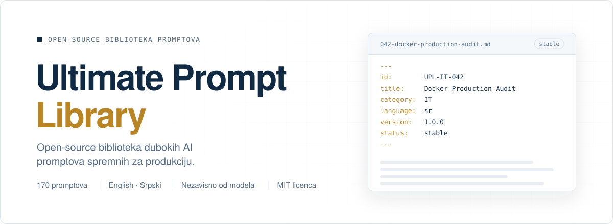

<a id="top"></a>

<p align="center">
  <picture>
    <source media="(prefers-color-scheme: dark)" srcset="assets/banner.sr.dark.svg">
    
  </picture>
</p>

<div align="center">

<!-- UPL:BEGIN hero-badges (generated by `npm run stats`; do not edit by hand) -->
<a href="#kolekcija"></a>
<a href="prompts/sr/01-it-programiranje-tehnologija/README.md"></a>
<a href="prompts/sr/02-ekonomija-finansije-poslovanje/README.md"></a>
<a href="README.md"></a>
<a href="LICENSE"></a>
<!-- UPL:END hero-badges -->

[English](README.md) &nbsp; · &nbsp; **Srpski**

Duboke i ponovo upotrebljive AI radne specifikacije za ozbiljnu analizu, razvoj, istraživanje i poslovno odlučivanje. Svaki prompt je verzionisan, dvojezičan i napravljen da daje strukturirane rezultate koje možeš da proveriš.

[**Otvori biblioteku**](https://ultimate-prompt-library.vercel.app/sr/) &nbsp; · &nbsp; [Pregledaj promptove](#pocni-ovde) &nbsp; · &nbsp; [Doprinesi](#doprinos)

</div>

<a id="pocni-ovde"></a>

<h2 align="center">Istraži kolekcije</h2>

<div align="center">

<h3>01 · IT, programiranje i tehnologija</h3>
<p><strong>100 promptova · Završeno</strong><br>Razvoj, arhitektura, bezbednost, DevOps, podaci, AI, testiranje i proizvodi.</p>
<p><a href="prompts/sr/01-it-programiranje-tehnologija/README.md"><strong>Otvori IT kolekciju →</strong></a></p>

<h3>02 · Ekonomija, finansije i poslovanje</h3>
<p><strong>100 promptova · Završeno</strong><br>Finansije, računovodstvo, tržišta, strategija, operacije, menadžment i rizik.</p>
<p><a href="prompts/sr/02-ekonomija-finansije-poslovanje/README.md"><strong>Otvori Business kolekciju →</strong></a></p>

</div>

<a id="kolekcija"></a>

<h2 align="center">Biblioteka u brojkama</h2>

<!-- UPL:BEGIN collection-stats (generated by `npm run stats`; do not edit by hand) -->
<p align="center"><strong>200</strong>&nbsp;jedinstvenih promptova &nbsp; · &nbsp; <strong>400</strong>&nbsp;lokalizovanih fajlova &nbsp; · &nbsp; <strong>2</strong>&nbsp;jezika &nbsp; · &nbsp; <strong>2 / 10</strong>&nbsp;aktivnih oblasti</p>
<!-- UPL:END collection-stats -->

<a id="oblasti"></a>

## Deset trajnih oblasti

Svaka oblast zadržava svoj ID prostor dok biblioteka raste. Objavljene kolekcije vode do indeksa promptova, a buduće oblasti su jasno označene.

<!-- UPL:BEGIN category-status (generated by `npm run stats`; do not edit by hand) -->
<table width="100%">
<tr>
<td valign="top" width="50%">
<sub>01 · <code>UPL-IT</code></sub><br>
<a href="prompts/sr/01-it-programiranje-tehnologija/README.md"><strong>IT, programiranje i tehnologija</strong></a><br>
<sub>Završeno · 100 / 100</sub>
</td>
<td valign="top" width="50%">
<sub>02 · <code>UPL-BIZ</code></sub><br>
<a href="prompts/sr/02-ekonomija-finansije-poslovanje/README.md"><strong>Ekonomija, finansije i poslovanje</strong></a><br>
<sub>Završeno · 100 / 100</sub>
</td>
</tr>
<tr>
<td valign="top" width="50%">
<sub>03 · <code>UPL-LAW</code></sub><br>
<a href="prompts/sr/03-pravo-administracija/README.md"><strong>Pravo i administracija</strong></a><br>
<sub>Planirano</sub>
</td>
<td valign="top" width="50%">
<sub>04 · <code>UPL-HEALTH</code></sub><br>
<a href="prompts/sr/04-zdravlje-medicina-wellness/README.md"><strong>Zdravlje, medicina i wellness</strong></a><br>
<sub>Planirano</sub>
</td>
</tr>
<tr>
<td valign="top" width="50%">
<sub>05 · <code>UPL-EDU</code></sub><br>
<a href="prompts/sr/05-obrazovanje-ucenje/README.md"><strong>Obrazovanje i učenje</strong></a><br>
<sub>Planirano</sub>
</td>
<td valign="top" width="50%">
<sub>06 · <code>UPL-SCI</code></sub><br>
<a href="prompts/sr/06-nauka-istrazivanje-analiza/README.md"><strong>Nauka, istraživanje i analiza</strong></a><br>
<sub>Planirano</sub>
</td>
</tr>
<tr>
<td valign="top" width="50%">
<sub>07 · <code>UPL-CAREER</code></sub><br>
<a href="prompts/sr/07-karijera-profesionalni-razvoj/README.md"><strong>Karijera i profesionalni razvoj</strong></a><br>
<sub>Planirano</sub>
</td>
<td valign="top" width="50%">
<sub>08 · <code>UPL-MKT</code></sub><br>
<a href="prompts/sr/08-marketing-prodaja-komunikacija/README.md"><strong>Marketing, prodaja i komunikacija</strong></a><br>
<sub>Planirano</sub>
</td>
</tr>
<tr>
<td valign="top" width="50%">
<sub>09 · <code>UPL-PROD</code></sub><br>
<a href="prompts/sr/09-produktivnost-organizacija-upravljanje/README.md"><strong>Produktivnost, organizacija i upravljanje</strong></a><br>
<sub>Planirano</sub>
</td>
<td valign="top" width="50%">
<sub>10 · <code>UPL-CREATIVE</code></sub><br>
<a href="prompts/sr/10-kreativnost-dizajn-mediji/README.md"><strong>Kreativnost, dizajn i mediji</strong></a><br>
<sub>Planirano</sub>
</td>
</tr>
</table>
<!-- UPL:END category-status -->

### Objavljene podkategorije

<!-- UPL:BEGIN subcategory-status (generated by `npm run stats`; do not edit by hand) -->
<details>
<summary><strong>IT, programiranje i tehnologija</strong> · 10 / 10 završeno</summary>

| # | Podkategorija |
|:---:|---|
| 01 | [Web razvoj](prompts/sr/01-it-programiranje-tehnologija/01-web-development/README.md) · 10 / 10 · Završeno |
| 02 | [Mobilni razvoj](prompts/sr/01-it-programiranje-tehnologija/02-mobile-development/README.md) · 10 / 10 · Završeno |
| 03 | [Backend i API](prompts/sr/01-it-programiranje-tehnologija/03-backend-api/README.md) · 10 / 10 · Završeno |
| 04 | [Sajber bezbednost](prompts/sr/01-it-programiranje-tehnologija/04-cybersecurity/README.md) · 10 / 10 · Završeno |
| 05 | [DevOps, cloud i infrastruktura](prompts/sr/01-it-programiranje-tehnologija/05-devops-cloud-infrastructure/README.md) · 10 / 10 · Završeno |
| 06 | [Baze podataka i data engineering](prompts/sr/01-it-programiranje-tehnologija/06-databases-data-engineering/README.md) · 10 / 10 · Završeno |
| 07 | [AI, LLM i automatizacija](prompts/sr/01-it-programiranje-tehnologija/07-ai-llm-automation/README.md) · 10 / 10 · Završeno |
| 08 | [Testiranje, QA i pouzdanost](prompts/sr/01-it-programiranje-tehnologija/08-testing-qa-reliability/README.md) · 10 / 10 · Završeno |
| 09 | [UX, UI i razvoj proizvoda](prompts/sr/01-it-programiranje-tehnologija/09-ux-ui-product-development/README.md) · 10 / 10 · Završeno |
| 10 | [Desktop, igre, sistemi i embedded](prompts/sr/01-it-programiranje-tehnologija/10-desktop-game-systems-embedded/README.md) · 10 / 10 · Završeno |

</details>

<details>
<summary><strong>Ekonomija, finansije i poslovanje</strong> · 10 / 10 završeno</summary>

| # | Podkategorija |
|:---:|---|
| 01 | [Finansijska analiza i korporativne finansije](prompts/sr/02-ekonomija-finansije-poslovanje/01-financial-analysis-corporate-finance/README.md) · 10 / 10 · Završeno |
| 02 | [Računovodstvo, izveštavanje i finansijska kontrola](prompts/sr/02-ekonomija-finansije-poslovanje/02-accounting-reporting-financial-control/README.md) · 10 / 10 · Završeno |
| 03 | [Ekonomija i analiza tržišta](prompts/sr/02-ekonomija-finansije-poslovanje/03-economics-market-analysis/README.md) · 10 / 10 · Završeno |
| 04 | [Poslovna strategija i analiza konkurencije](prompts/sr/02-ekonomija-finansije-poslovanje/04-business-strategy-competitive-analysis/README.md) · 10 / 10 · Završeno |
| 05 | [Preduzetništvo i poslovni modeli](prompts/sr/02-ekonomija-finansije-poslovanje/05-entrepreneurship-business-models/README.md) · 10 / 10 · Završeno |
| 06 | [Operacije, lanac snabdevanja i nabavka](prompts/sr/02-ekonomija-finansije-poslovanje/06-operations-supply-chain-procurement/README.md) · 10 / 10 · Završeno |
| 07 | [Prodaja, prihodi i cene](prompts/sr/02-ekonomija-finansije-poslovanje/07-sales-revenue-pricing/README.md) · 10 / 10 · Završeno |
| 08 | [Menadžment, liderstvo i organizacija](prompts/sr/02-ekonomija-finansije-poslovanje/08-management-leadership-organization/README.md) · 10 / 10 · Završeno |
| 09 | [Rizik, usklađenost i poslovna otpornost](prompts/sr/02-ekonomija-finansije-poslovanje/09-risk-compliance-business-resilience/README.md) · 10 / 10 · Završeno |
| 10 | [Investicije, vrednovanje i due diligence](prompts/sr/02-ekonomija-finansije-poslovanje/10-investment-valuation-due-diligence/README.md) · 10 / 10 · Završeno |

</details>
<!-- UPL:END subcategory-status -->

<a id="o-projektu"></a>

## Za zadatke kojima treba više od brzog odgovora

Ultimate Prompt Library (UPL) je model-agnostic open-source kolekcija detaljnih uputstava za rad uz AI. Promptovi definišu obim, standard dokaza, moguće načine greške, očekivani format i korake provere. Tako sposobni modeli mogu da daju strukturiran i proverljiv rezultat.

**Dobar prompt za početak:** [UPL-IT-001 · Forensic Full Repository Audit](prompts/sr/01-it-programiranje-tehnologija/01-web-development/001-forensic-full-repository-audit.md) · [English](prompts/en/01-it-programming-technology/01-web-development/001-forensic-full-repository-audit.md)

<a id="razlike"></a>

### Dosledan standard za svaki prompt

- **Jasan fokus:** definisana uloga, cilj, obim i zadaci koji nisu predmet rada.
- **Dokazi ispred pretpostavki:** prioriteti izvora, pouzdanost i zaštita od lažno pozitivnih nalaza.
- **Koristan rezultat:** konkretan format, primeri i očekivana pokrivenost.
- **Proverljivost:** praktične provere i završna kontrola kvaliteta kada su potrebne.

Detaljna specifikacija je u [vodiču za format promptova](docs/prompt-format.sr.md).

<a id="kako-se-koristi"></a>

## Pokreni prompt u radu

1. Otvori prompt na [srpskom](prompts/sr/) ili [engleskom](prompts/en/).
2. Kopiraj sadržaj prompta u ChatGPT, Claude, Gemini, coding agent ili drugi sposoban model. Front matter na početku su metapodaci i možeš da ga izostaviš.
3. Dodaj fajlove, repozitorijum ili drugi kontekst potreban za zadatak.
4. Suzi obim kada želiš da se rad usmeri na konkretan modul ili pitanje.
5. Proveri rezultat. Kvalitet zavisi od modela, konteksta i dostupnih alata.

Mašinski čitljiv [`prompts.json`](indexes/prompts.json) sadrži ID-eve, nazive, statuse, verzije i putanje promptova.

<a id="struktura"></a>

## Jednostavna i stabilna struktura

```text
prompts/       Promptovi na srpskom i engleskom, grupisani po oblastima
catalog.json   Definicije oblasti, trajni ID-evi i planirani unosi
indexes/       Generisani JSON indeksi i statistika kolekcije
docs/          Format prompta, arhitektura, prevod i roadmap
scripts/       Alati za generisanje i validaciju
site-src/      Izvor koda za pretraživi web sajt
```

<a id="jezici"></a>

## Srpski i engleski ostaju usklađeni

Svaki objavljeni prompt ima isti trajni ID, broj, slug i verziju na oba jezika. Prompt dobija status `stable` kada postoje sve podržane jezičke verzije. Tehnički termini ostaju na engleskom kada je tako prirodnije.

<a id="format"></a>

## Promptovi su verzionisani dokumenti

Svaki Markdown fajl počinje YAML metapodacima. Trajni ID povezuje jezičke verzije i ne menja se kada se sadržaj unapređuje. Pogledaj [vodič za format](docs/prompt-format.sr.md) i [pravila za ID-eve](docs/ids.md).

<a id="doprinos"></a>

## Pomozi da biblioteka raste

Unapredi postojeći prompt, prevedi ga ili predloži novu ideju kroz [uputstvo za doprinos](CONTRIBUTING.sr.md). Planirani promptovi već imaju rezervisane ID-eve, zato pre predloga proveri [`catalog.json`](catalog.json).

```bash
npm ci
npm run generate
npm run validate
```

<a id="kvalitet"></a>

Validacija proverava strukturu promptova, ID-eve, jezičke parove, interne linkove i generisane fajlove. Ona ne garantuje kvalitet AI odgovora. Proveri rezultate pre nego što se osloniš na njih.

> **Bezbednost:** Bezbednosne promptove koristi samo za defanzivni pregled, bezbedan razvoj i testiranje sistema koje poseduješ ili za koje imaš izričito ovlašćenje. Pročitaj [bezbednosnu politiku](SECURITY.md).

<a id="roadmap"></a>

## Šta sledi

IT i Business kolekcije su završene. Preostalih osam oblasti je planirano i razvijaće se jedna po jedna. [Javni web sajt](https://ultimate-prompt-library.vercel.app/sr/) je aktivan i nudi pretragu, filtere, izbor jezika i trajne linkove do promptova.

Planove kolekcija i smer razvoja pogledaj u [kompletnom roadmap-u](docs/roadmap.sr.md).

<a id="licenca"></a>

## Open-source i podrška

Objavljeno pod [MIT licencom](LICENSE). Pogledaj [Kodeks ponašanja](CODE_OF_CONDUCT.md), [bezbednosnu politiku](SECURITY.md) i [changelog](CHANGELOG.md).

Ako ti je biblioteka korisna, podrži njen razvoj preko [Ko-fi](https://ko-fi.com/o0o0o0o) ili [PayPal-a](https://www.paypal.com/paypalme/o0o0o0o0o0o0o).

<p align="center"><sub>Razvija zajednica · Nezavisno od modela · Napravljeno za ozbiljan rad</sub><br><a href="#top">Nazad na vrh ↑</a></p>
